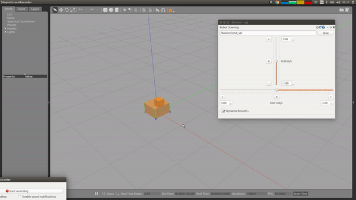

# hector_gazebo_plugins
hector_gazebo_plugins provides gazebo plugins from Team Hector. Currently it contains a 6wd differential drive plugin, an IMU sensor plugin, an earth magnetic field sensor plugin, a GPS sensor plugin, a sonar ranger plugin and a plugin to move by using force robots (useful for complicated wheeled robots).

# Available Plugins

## DiffDrivePlugin6W
This plugin serves as a controller for a 6-wheeled light-weight robot using differential drive.

## GazeboRosImu
GazeboRosImu is a replacement for the GazeboRosImu plugin in package gazebo_plugins. It simulates an Inertial Measurement Unit (IMU) affected by Gaussian noise and low-frequency random drift. The orientation returned mimics a simple Attitude and Heading Reference System (AHRS) using the (erroneous) rates and accelerations.

### Published Topics
* imu (`sensor_msgs/Imu`):
    The simulated IMU measurements (in body coordinates) and estimated orientation relative to the world frame.

### Advertised Services

* imu/calibrate (std_srvs/Empty):
    Resets the offset and drift error of the gyroscopes.
* imu/set_accel_bias (hector_gazebo_plugins/SetBias):
    Sets the current offset error of the accelerometers and resets random drift.
* imu/set_gyro_bias (hector_gazebo_plugins/SetBias):
    Sets the current offset error of the gyroscopes and resets the random drift.

### XML Parameters

* updateRate (double): the update rate of the sensor in hertz
* robotNamespace (string): namespace prefix for topic and service names
* bodyName (string, required): name of the body which holds the IMU sensor
* topicName (string): name of the sensor output topic and prefix of service names (defaults to imu)
* serviceName (string): name of the calibrate service (for compatibility with gazebo_plugins, defaults to [topicName]/calibrate)
* accelOffset (Vector3): constant acceleration offset
* accelDrift (Vector3): standard deviation of the acceleration drift error
* accelDriftFrequency (Vector3): mean frequency of the acceleration drift
* accelGaussianNoise (Vector3): standard deviation of the additive Gaussian acceleration noise
* rateOffset (Vector3): constant rate offset
* rateDrift (Vector3): standard deviation of the rate drift error
* rateDriftFrequency (Vector3): mean frequency of the rate drift
* rateGaussianNoise (Vector3): standard deviation of the additive Gaussian rate noise
* yawOffset (double): constant yaw/heading offset
* yawDrift (double): standard deviation of the yaw/heading drift error
* yawDriftFrequency (double): mean frequency of the yaw/heading drift
* yawGaussianNoise (double): standard deviation of the yaw/heading additive Gaussian noise
* rpyOffsets (Vector3): if non-zero, used to calculate accelOffset and yawOffset so that resulting roll,  pitch and yaw errors correspond to this values when the platform is leveled (for compatibility with gazebo_ plugins)
* gaussianNoise (double): if non-zero, this value is used as standard deviation of Gaussian noise for  acceleration and angular rate measurements (for compatibility with gazebo_plugins)

##  GazeboRosGps
GazeboRosGps simulates a GNSS (Global Navigation Satellite System) receiver which is attached to a robot. It publishes `sensor_msgs/NavSatFix` messages with the robot's position and altitude in WGS84 coordinates. The reference point that corresponds to the origin of the gazebo frame can be configured using the XML parameters. The conversion between gazebo coordinates and WGS84 is done using a simple equirectangular projection, which is accurate enough if you do not go far away from the configured reference point and if you do not want to use the plugin for polar regions.

### Published Topics

* fix (sensor_msgs/NavSatFix):
    The simulated GNSS position in WGS84 coordinates (latitude, longitude and altitude).
* fix_velocity (geometry_msgs/Vector3Stamped):
    The GNSS velocity vector in NWU (north, west, up) coordinates.

### XML Parameters

* updateRate (double): the update rate of the sensor in milliseconds
* robotNamespace (string): namespace prefix for topic names
* bodyName (string, required): name of the body the GNSS receiver is attached to
* frameId (string): frame_id included in the message headers (defaults to empty)
* topicName (string): fix output topic (defaults to fix)
* velocityTopicName (string): velocity output topic (defaults to fix_velocity)
* referenceLatitude (double): latitude of the reference point in degrees north (defaults to 49.9)
* referenceLongitude (double): longitude of the reference point in degrees east (defaults to 8.9)
* referenceHeading (double): geographic heading of gazebo frame's x axis in degrees (defaults to 0.0)
* referenceAltitude (double): altitude (height above WGS84 ellipsoid) of the reference point in meters (* defaults to 0.0)
* status (int8): status flag in the fix message (defaults to STATUS_FIX, see sensor_msgs/NavSatStatus)
* service (uint16): service flag in the fix message (defaults to SERVICE_GPS, see sensor_msgs/NavSatStatus)
* offset (Vector3): a constant position offset in meters given in gazebo coordinates
* drift (Vector3): standard deviation of the position drift error
Note: The current velocity error is added to the position drift in each update step. Even if this parameter is zero, the velocity error is also reflected in the position.
* driftFrequency (Vector3): mean frequency of the position drift
* gaussianNoise (Vector3): standard deviation of the additive Gaussian noise added to the position
* velocityOffset (Vector3): constant velocity offset in meters/seconds given in gazebo coordinates
* velocityDrift (Vector3): standard deviation of the velocity error
* velocityDriftFrequency (Vector3): mean frequency of the velocity drift
* velocityGaussianNoise (Vector3): standard deviation of the additive Gaussian noise added to the velocity

## GazeboRosMagnetic
This plugin simulates a 3-axis magnetometer like PNI Corp's MicroMag. Like for the GPS plugin, the orientation of the gazebo frame can be specified via the referenceHeading parameter. Declination, inclination and field magnitude have to be configured depending on your location on earth. The default parameters are valid for Europe and North America without magnitude information (normalized vector). Check http://www.ngdc.noaa.gov/geomag/WMM/DoDWMM.shtml for exact parameters.

### Published Topics

* magnetic (geometry_msgs/Vector3Stamped):
The magnetic field vector given in body coordinates.

### XML Parameters

* updateRate (double): the update rate of the sensor in milliseconds
* robotNamespace (string): namespace prefix for topic names
* bodyName (string, required): name of the body the sensor is attached to
* topicName (string): fix output topic (defaults to /fix)
* magnitude (double): magnitude of the magnetic field in whatever unit you want (defaults to 1.0)
* referenceHeading (double): geographic heading of gazebo frame's x axis in degrees (defaults to 0.0)
* declination (double): declination (angle between true and magnetic north) in degrees (defaults to 0.0)
* inclination (double): inclination (angle between the horizontal plane and the magnetic field) in degrees (* defaults to 60.0)
* offset (Vector3): a constant offset added to the magnetic field vector. This parameter can be used to simulate deviation caused by magnetized iron within the robot.
* drift (Vector3): standard deviation of the drift error
* driftFrequency (Vector3): mean frequency of the drift
* gaussianNoise (Vector3): standard deviation of the additive Gaussian noise added to the magnetic field

## GazeboRosSonar
The GazeboRosSonar plugin is a ROS controller for gazebo's built-in ray sensor. The value returned as sonar range is the minimum of all rays, as a sonar ranger returns the distance corresponding to the first echo returned from a object within it's field of view. The behavior of this controller plugin depends mainly on the parameters of the sensor it is attached to.

The <controller:hector_gazebo_ros_sonar> tag is only valid within a surrounding <sensor:ray> tag. You should use the macro defined in sonar_sensor.urdf.xacro in package hector_sensors_description to include a sonar sensor to your model.

### Published Topics

* sonar (sensor_msgs/Range):
A Range message containing the minimum distance of all rays. The field_of_view, min_range and max_range values reflect the parameters of the ray sensor.

### XML Parameters

* updateRate (double): the update rate of the sensor in milliseconds, should be equal to the update rate of the containing sensor's updateRate
* robotNamespace (string): namespace prefix for topic names
* frameId (string): frame_id included in the message header
* topicName (string): name of the sensor output topic (defaults to sonar)
* offset (double): a constant offset added to the range
* drift (double): standard deviation of the drift error
* driftFrequency (double): mean frequency of the drift
* gaussianNoise (double): standard deviation of the additive Gaussian noise

## GazeboRosForceBasedMove
The GazeboRosForceBasedMove plugin is a ROS controller that uses a `geometry_msgs/Twist` message to exert
forces on a robot, resulting in motion. Based on the planar_move plugin by Piyush Khandelwal. Useful for robots with complicated wheeled based that are hard(er) to simulate otherwise. For example, three wheeled holonomic bases.

You'll need to configure the wheels as static links (or fixed joints) and give them reasonable mu, mu2 and fdir gazebo parameters.

You can find an example of a simple robot in `roslaunch hector_gazebo_plugins boxbot_example.launch`.

.

### Subscribed Topics
* cmd_vel: `geometry_msgs/Twist` command topic.

### Published Topics
* odom: `nav_msgs/Odometry` of the robot. (Optional)

### XML Parameters

* robotNamespace (string): namespace prefix for topic names. Defaults to '' (empty).
* commandTopic (string): topic to listen for `geometry_msgs/Twist` messages, typically `cmd_vel`. Defaults to `cmd_vel`.
* odometryTopic (string): topic where to publish the `nav_msgs/Odometry` odometry of the robot. Defaults to `odom`
* odometryFrame (string): frame_id included in the message header of Odometry messages. Defaults to `odom`.
* odometryRate (double): rate (Hz) to publish odometry, defaults to 20.0.
* publishOdometryTf (bool): if to publish the odometry in TF, defaults to **true**.
* robotBaseFrame (string): base frame on to where apply the forces to move, defaults to `base_footprint`.

Note that all the PIDs are available as a dynamic_reconfigure server (at your_namespace/force_based_move/[x/y/yaw]\_pid) to tune on the fly, so once you find useful values you can write them down in the SDF.
They are highly correlated to your mu, mu2 and fdir variables and the mass of the robot.
The PIDs are implemented via the `control_toolbox::Pid` class.

* yaw_velocity_p_gain (double): Proportional gain to apply to yaw. Defaults to 0.0.
* yaw_velocity_i_gain (double): Integrative gain to apply to yaw. Defaults to 0.0.
* yaw_velocity_d_gain (double): Derivative gain to apply to yaw. Defaults to 0.0.
* yaw_velocity_i_clamp (double): Clamping of integrative gain value. Defaults to 0.0.
* x_velocity_p_gain (double): Proportional gain to apply to x. Defaults to 0.0.
* x_velocity_i_gain (double): Integrative gain to apply to x. Defaults to 0.0.
* x_velocity_d_gain (double): Derivative gain to apply to x. Defaults to 0.0.
* x_velocity_i_clamp (double): Clamping of integrative gain value. Defaults to 0.0.
* y_velocity_p_gain (double): Proportional gain to apply to y. Defaults to 0.0.
* y_velocity_i_gain (double): Integrative gain to apply to y. Defaults to 0.0.
* y_velocity_d_gain (double): Derivative gain to apply to y. Defaults to 0.0.
* y_velocity_i_clamp (double): Clamping of integrative gain value. Defaults to 0.0.

# Sensor Error Model
All simulated sensors from this package use the same generic model for sensor errors like

* constant offset
* low-frequency drift (modeled as a first order Markov random process with defined mean frequency and mean standard deviation)
* gaussian noise (with defined standard deviation).
The parameters are initialized to 0 by default (no sensor error). The default drift frequency is 0.00027 Hz (one hour period).

# See also
You can find some more plugins useful for aerial vehicles in package [hector_quadrotor_gazebo_plugins](http://wiki.ros.org/hector_quadrotor_gazebo_plugins).

